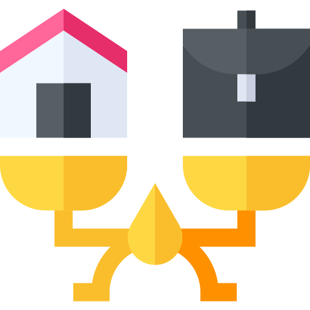

<!-- PROJECT LOGO -->
 

  

  <h3 align="center"><strong>Países con mayor calidad de vida</strong></h3>

  

    Proyecto final para el modulo "Programación y Estadística con R"
  

  

  
  
  
  
  

## Acerca del proyecto

Este proyecto tiene como proposito realizar un analisis de la calidad de vida de ciertos paises, con el fin de determinar cuál de ellos podria ser la mejor opcion para vivir o buscar un empleo, todo esto, haciendo uso de herramientas estadísticas y computacionales, siendo el principal aliado, el lenguaje de programacion `R` 

## Acerca de la beca

Esta beca es iniciativa del _"Grupo Santander"_ enfocada en la formación de competencias tecnológicas con el objetivo de desarrollar habilidades digitales altamente valoradas en el mercado.
 
 
El programa logrará que el estudiante obtenga la capacidad de tomar decisiones, generar reportes, crear visualizaciones, responder preguntas y resolver problemas sobre bases de datos con las lenguajes R y Python haciendo uso de diferentes librerías, herramientas y paquetes para el análisis de datos.
 

## Indíce

- [Sesión 1](src/Sesion-01)
- [Sesión 2](src/Sesion-02)
- [Sesión 3](src/Sesion-03)
- [Sesión 4](src/Sesion-04)
- [Sesión 5](src/Sesion-05)
- [Sesión 6](src/Sesion-06)
- [Sesión 7](src/Sesion-07)
- [Sesión 8](src/Sesion-08)

## Requerimientos
* RStudio | Jetbrains PyCharm
* R

## Acerca de los colaboradores
- [Elias Farias Abraham](https://github.com/Aabraham-Farias)
- [Montiel Cardona Iván](https://github.com/begeistert)
- [Tostado Blazquez Raul](https://github.com/RaulTostadoB)
- [Viveros Sánchez Alejandro](https://github.com/alevs97)

## Licencia 
Distribuido bajo la licencia MIT. Consulte `LICENCE` para obtener más información.

###### [Equipo 17](https://github.com/Team-17-Bedu)

